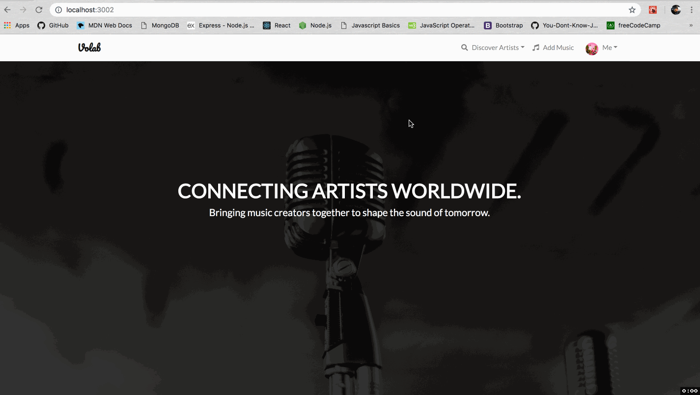
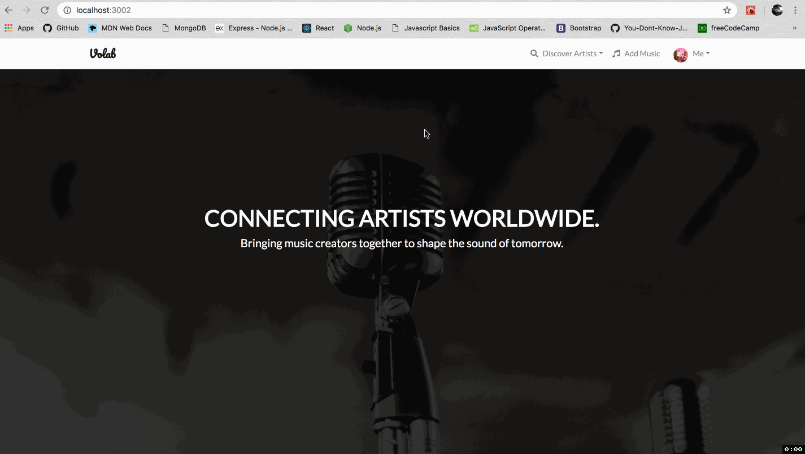
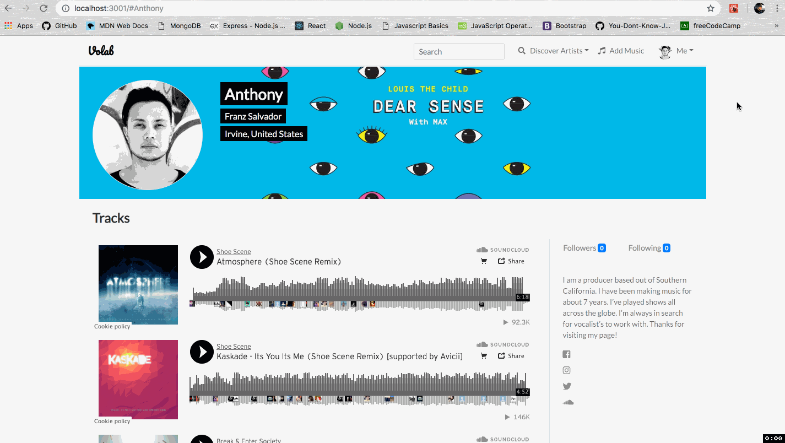

# volab
A full stack project using MERN to build a social network that brings music producers and vocalists together to collaborate.

https://volab-app.herokuapp.com/

## Technologies Used
- Javascript
- HTML5
- CSS3
- Bootstrap
- ReactJS
- MongoDB
- ExpressJS
- NodeJS
- Sendgrid API

System Requirements
- Node.js v10
- NPM v6
- MongoDB v4

## Key Features
### User can create a profile.


### User can add music.


### User can discover other artists.


### User can follow other artists.


### User can send messages via Sendgrid.


### User can search for artists using a search bar.


## Usage

Clone the repository.
```
git clone https://github.com/franzsalvador/volab.git
```

Install dependencies.
```
cd volab
npm install
```
Create a .env file in the project root. Example:
```
MONGODB_URI=mongodb://localhost:27017/volab-app
PORT=3000
SENDGRID_API_KEY=your_api_key
```
Automatically run/restart server with `nodemon` and live reload page on update with `browser-sync`
```
npm run watch
```
Run without `nodemon` and `browser-sync`
```
npm run build
npm run start
